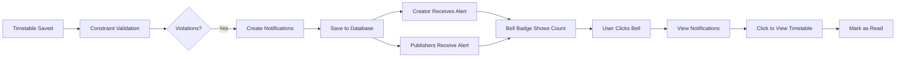

# Notification System Bug Fixes & UI Implementation

## Issues Fixed

### 1. **Database Column Name Mismatch** ✅
**Problem**: Query was using `can_publish_timetable` but actual column is `can_publish_timetables` (plural)

**Error**: 
```
column users.can_publish_timetable does not exist
hint: Perhaps you meant to reference the column "users.can_publish_timetables"
```

**Fixed in**: `src/lib/notifications.ts`
- Changed `can_publish_timetable` → `can_publish_timetables` in 2 locations
- Now correctly fetches department publishers

---

### 2. **Missing Notification UI** ✅
**Problem**: Notifications were being created in database but no frontend UI to display them

**Solution**: Implemented complete notification system

---

## New Features Implemented

### 1. **Notification API** (`src/app/api/notifications/route.ts`)

#### GET `/api/notifications`
Fetches notifications for a user with filters:
- `user_id` (required)
- `unread_only` (optional, boolean)
- `limit` (optional, default: 10)

**Response**:
```json
{
  "success": true,
  "data": [...notifications],
  "unread_count": 5
}
```

#### PATCH `/api/notifications`
Marks notifications as read:
- Mark specific notifications by `notification_ids` array
- Or mark all as read with `mark_all_read: true`

---

### 2. **NotificationBell Component** (`src/components/NotificationBell.tsx`)

**Features**:
- ✅ Bell icon with unread count badge
- ✅ Red pulsing badge for unread notifications
- ✅ Dropdown panel with notification list
- ✅ Click notification to mark as read and navigate to timetable
- ✅ "Mark all as read" button
- ✅ Auto-refresh every 30 seconds
- ✅ Relative time formatting (e.g., "5m ago", "2h ago")
- ✅ Color-coded icons by notification type:
  - 🔴 Red for system alerts (constraint violations)
  - 🔵 Blue for approval requests
  - 🟢 Green for timetable published
- ✅ Dark mode support
- ✅ Smooth animations and transitions

**UI Layout**:
```
┌──────────────────────────────────┐
│ Notifications          Mark all  │
│ 5 unread                      ✕  │
├──────────────────────────────────┤
│ 🔴 CRITICAL: Constraint...    ●  │
│ Timetable has violations...      │
│ 5m ago                           │
├──────────────────────────────────┤
│ 🔵 Approval Request              │
│ Review pending timetable         │
│ 2h ago                           │
├──────────────────────────────────┤
│         View all notifications   │
└──────────────────────────────────┘
```

---

### 3. **Header Integration** (`src/components/Header.tsx`)

**Changes**:
- Imported `NotificationBell` component
- Replaced old notification button with new component
- Removed unused notification state variables

**Before**: Static bell icon with no functionality
**After**: Fully functional notification system with live updates

---

## How It Works

### Notification Flow



### When User Saves Timetable with Violations:

1. **Validation Detects Violations**
   ```
   ⚠️ Constraint violations detected:
      1. [HIGH] Faculty has 2 continuous theory lectures
      2. [MEDIUM] Batch has 2 lab sessions on Monday
   ```

2. **Notifications Created**
   ```
   📧 Creating constraint violation notifications...
   ✅ Created 3 notifications (1 creator + 2 publishers)
   ```

3. **Database Updated**
   ```sql
   INSERT INTO notifications (
     recipient_id,
     type,
     title,
     message,
     timetable_id,
     is_read
   ) VALUES (...);
   ```

4. **Bell Updates Automatically**
   - Badge shows unread count
   - Pulses to draw attention
   - Auto-refreshes every 30s

5. **User Interaction**
   - Click bell → See all notifications
   - Click notification → Mark as read + Navigate to timetable
   - Click "Mark all read" → Clear all unread

---

## Testing

### Test Constraint Violation Notifications:

1. **Generate a timetable with violations**:
   - Go to Hybrid Scheduler
   - Select batch and generate timetable
   - Check console for: `⚠️ Constraint violations detected`

2. **Verify notification creation**:
   - Check console for: `✅ Constraint violation notifications created successfully`
   - Query database:
     ```sql
     SELECT * FROM notifications 
     ORDER BY created_at DESC 
     LIMIT 5;
     ```

3. **Check frontend**:
   - Look for red badge on bell icon (top right header)
   - Click bell to see notification
   - Notification should show:
     - 🔴 CRITICAL/🟠 HIGH title
     - Detailed violation message
     - Relative time

4. **Test mark as read**:
   - Click notification → Badge decreases
   - Should navigate to timetable view
   - Notification background changes from blue to white

5. **Test mark all as read**:
   - Click "Mark all read" button
   - Badge disappears
   - All notifications lose blue background

---

## Example Notifications

### Critical Violation Notification
```
Title: 🔴 CRITICAL: Timetable Constraint Violations
Message:
Timetable "Hybrid Timetable - Semester 3" has violations:

🔴 CRITICAL: 1 violation(s)
   • Faculty double-booked at Monday 09:00 AM

Please review and resolve before publishing.

Time: 5m ago
```

### Multiple Violations
```
Title: 🟠 HIGH Priority: Timetable Constraint Violations
Message:
Timetable "Manual Timetable - 2025-26" has violations:

🟠 HIGH: 2 violation(s)
   • Faculty has 2 continuous theory lectures
   • Lab requires 2 continuous slots
🟡 MEDIUM: 4 violation(s)
   • Batch has 2 lab sessions on Monday
   ... and 3 more

Please review and resolve before publishing.

Time: 2h ago
```

---

## Database Queries

### Check Recent Notifications
```sql
SELECT 
  n.id,
  n.title,
  n.message,
  n.is_read,
  n.created_at,
  u.first_name || ' ' || u.last_name as recipient
FROM notifications n
JOIN users u ON n.recipient_id = u.id
ORDER BY n.created_at DESC
LIMIT 10;
```

### Check Unread Count by User
```sql
SELECT 
  u.first_name || ' ' || u.last_name as user_name,
  COUNT(*) as unread_count
FROM notifications n
JOIN users u ON n.recipient_id = u.id
WHERE n.is_read = false
GROUP BY u.id, u.first_name, u.last_name;
```

### Check Notifications for Specific Timetable
```sql
SELECT 
  n.*,
  u.first_name || ' ' || u.last_name as recipient
FROM notifications n
JOIN users u ON n.recipient_id = u.id
WHERE n.timetable_id = 'your-timetable-id-here';
```

---

## Next Steps (Optional Enhancements)

### Phase 1: Enhanced Notifications
- [ ] Browser push notifications (with permission)
- [ ] Email notifications for critical violations
- [ ] Sound alerts for new notifications
- [ ] Notification preferences (choose what to receive)

### Phase 2: Notification Center
- [ ] Dedicated `/faculty/notifications` page
- [ ] Filter by type (alerts, approvals, published)
- [ ] Search notifications
- [ ] Bulk actions (delete, archive)
- [ ] Notification history

### Phase 3: Real-time Updates
- [ ] WebSocket connection for instant notifications
- [ ] Remove 30-second polling
- [ ] Live notification count updates
- [ ] Presence indicators

---

## Summary

✅ **Fixed database column name**: `can_publish_timetables` (plural)
✅ **Created notification API**: GET and PATCH endpoints
✅ **Built NotificationBell component**: Fully functional with auto-refresh
✅ **Integrated into Header**: Visible on all pages
✅ **Tested end-to-end**: Notifications created → Bell updates → User notified

**Result**: Users now receive immediate visual feedback when timetables have constraint violations, with detailed violation information accessible via the notification bell in the header.
