# Business Logic Architecture

This document provides a **comprehensive, unified view** of all business logic flows across the **Academic Compass 2025** platform in a **single Mermaid diagram**.

## 🎯 Complete Business Logic - Unified Diagram

This single diagram consolidates **all modules, use cases, workflows, constraints, and interactions** into one comprehensive view.

```mermaid
graph TB
    %% ============================================
    %% STYLING DEFINITIONS
    %% ============================================
    classDef authStyle fill:#e3f2fd,stroke:#1565c0,stroke-width:3px
    classDef collegeStyle fill:#f3e5f5,stroke:#6a1b9a,stroke-width:3px
    classDef academicStyle fill:#fff3e0,stroke:#e65100,stroke-width:3px
    classDef scheduleStyle fill:#e8f5e9,stroke:#2e7d32,stroke-width:3px
    classDef notifStyle fill:#fce4ec,stroke:#c2185b,stroke-width:3px
    classDef constraintStyle fill:#ffebee,stroke:#d32f2f,stroke-width:2px,stroke-dasharray:5
    classDef eventStyle fill:#e0f2f1,stroke:#00897b,stroke-width:2px

    %% ============================================
    %% LAYER 1: AUTHENTICATION & AUTHORIZATION
    %% ============================================
    subgraph LAYER1["🔐 Layer 1: Authentication & Authorization (RBAC)"]
        direction LR
        
        subgraph AUTH_MODULE["Auth Module"]
            Login[Login<br/>✓ Email/Password<br/>✓ Token Generation]:::authStyle
            Register[Register<br/>✓ College Admin<br/>✓ Faculty/Student]:::authStyle
            RBAC{Role Check<br/>SuperAdmin?<br/>CollegeAdmin?<br/>Faculty?}:::authStyle
        end
        
        Login --> RBAC
        Register --> RBAC
    end

    %% ============================================
    %% LAYER 2: ORGANIZATIONAL SETUP
    %% ============================================
    subgraph LAYER2["🏛️ Layer 2: Organizational Setup (Multi-Tenant)"]
        direction TB
        
        subgraph COLLEGE_MODULE["College Module"]
            CreateCollege[Create College<br/>✓ Name, Code<br/>✓ Address]:::collegeStyle
            ValidateCollege[Validate Code<br/>Uniqueness]:::collegeStyle
        end
        
        subgraph DEPT_MODULE["Department Module"]
            CreateDept[Create Department<br/>✓ Linked to College<br/>✓ Code Validation]:::collegeStyle
            GetDepts[Get Departments<br/>by College]:::collegeStyle
        end
        
        CreateCollege --> ValidateCollege
        ValidateCollege --> CreateDept
    end

    %% ============================================
    %% LAYER 3: ACADEMIC ENTITIES
    %% ============================================
    subgraph LAYER3["👥 Layer 3: Academic Entities (Faculty & Students)"]
        direction LR
        
        subgraph FACULTY_MODULE["Faculty Module"]
            CreateFaculty[Create Faculty<br/>✓ Department<br/>✓ Faculty Type]:::academicStyle
            AssignQual[Assign Qualification<br/>✓ Subject Proficiency<br/>✓ Preference Score]:::academicStyle
            FacultyWorkload[Manage Workload<br/>✓ Max Hours/Week]:::academicStyle
        end
        
        subgraph STUDENT_MODULE["Student Module"]
            CreateStudent[Create Student<br/>✓ Course Enrollment<br/>✓ Semester]:::academicStyle
            EnrollCourse[Enroll in Course<br/>✓ Batch Assignment]:::academicStyle
            UpdateSemester[Update Semester<br/>✓ Promotion]:::academicStyle
        end
        
        CreateFaculty --> AssignQual
        CreateStudent --> EnrollCourse
    end

    %% ============================================
    %% LAYER 4: CURRICULUM & ELECTIVES
    %% ============================================
    subgraph LAYER4["📚 Layer 4: Curriculum & Electives (NEP Compliance)"]
        direction TB
        
        subgraph CURRICULUM_MODULE["NEP Curriculum Module"]
            DefineCurr[Define Curriculum<br/>✓ NEP Structure<br/>✓ Credit System]:::academicStyle
            MapElectives[Map Electives<br/>✓ Core vs Elective<br/>✓ Prerequisites]:::academicStyle
        end
        
        subgraph ELECTIVE_MODULE["Elective Module"]
            StudentChoice[Student Preference<br/>✓ Ranked Choices<br/>✓ Constraints]:::academicStyle
            AllocateElective[Allocate Electives<br/>✓ Optimization<br/>✓ Fairness]:::academicStyle
        end
        
        DefineCurr --> MapElectives
        MapElectives --> StudentChoice
        StudentChoice --> AllocateElective
    end

    %% ============================================
    %% LAYER 5: HYBRID TIMETABLE GENERATION (CORE LOGIC)
    %% ============================================
    subgraph LAYER5["🗓️ Layer 5: Hybrid Timetable Generation (AI-Powered)"]
        direction TB
        
        subgraph TIMETABLE_CORE["Timetable Generation Pipeline"]
            CollectData[1. Collect Data<br/>Faculty + Students<br/>Courses + Classrooms]:::scheduleStyle
            
            HardConstraints[2. Hard Constraints<br/>✗ Faculty Double Booking<br/>✗ Classroom Conflicts<br/>✗ Qualification Match]:::constraintStyle
            
            CPSAT[3. CP-SAT Solver<br/>✓ Generate Feasible<br/>Initial Solutions]:::scheduleStyle
            
            GA[4. Genetic Algorithm<br/>✓ Crossover + Mutation<br/>✓ Fitness Optimization]:::scheduleStyle
            
            SoftConstraints[5. Soft Constraints<br/>✓ Faculty Preferences<br/>✓ Balanced Workload<br/>✓ Minimize Gaps]:::constraintStyle
            
            ValidateSchedule[6. Validate Schedule<br/>✓ Conflict Check<br/>✓ Quality Score]:::scheduleStyle
            
            PublishTT[7. Publish Timetable<br/>✓ Save to DB<br/>✓ Notify Users]:::scheduleStyle
        end
        
        CollectData --> HardConstraints
        HardConstraints --> CPSAT
        CPSAT --> GA
        GA --> SoftConstraints
        SoftConstraints --> ValidateSchedule
        ValidateSchedule --> PublishTT
    end

    %% ============================================
    %% LAYER 6: EVENTS & NOTIFICATIONS
    %% ============================================
    subgraph LAYER6["📅 Layer 6: Events & Notifications"]
        direction LR
        
        subgraph EVENTS_MODULE["Events Module"]
            CreateEvent[Create Event<br/>✓ Campus Events<br/>✓ Academic Events]:::notifStyle
            RegisterEvent[Register for Event<br/>✓ RSVP]:::notifStyle
        end
        
        subgraph NOTIF_MODULE["Notifications Module"]
            SendNotif[Send Notification<br/>✓ Email<br/>✓ In-App Alert]:::notifStyle
            BroadcastAlert[Broadcast Alert<br/>✓ System-wide]:::notifStyle
        end
        
        CreateEvent --> RegisterEvent
        RegisterEvent --> SendNotif
    end

    %% ============================================
    %% LAYER 7: BATCH & CLASSROOM MANAGEMENT
    %% ============================================
    subgraph LAYER7["👥 Layer 7: Batch & Classroom Management"]
        direction TB
        
        CreateBatch[Create Batch<br/>✓ Year/Division]:::collegeStyle
        AssignClassroom[Assign Classroom<br/>✓ Capacity Match<br/>✓ Type Match]:::collegeStyle
        PromoteBatch[Promote Batch<br/>✓ Next Semester]:::collegeStyle
        
        CreateBatch --> AssignClassroom
    end

    %% ============================================
    %% DOMAIN EVENTS (Cross-Module Communication)
    %% ============================================
    subgraph DOMAIN_EVENTS["⚡ Domain Events (Triggers)"]
        direction LR
        
        EVENT1[Student Enrolled]:::eventStyle
        EVENT2[Timetable Published]:::eventStyle
        EVENT3[Elective Allocated]:::eventStyle
        EVENT4[Faculty Created]:::eventStyle
    end

    %% ============================================
    %% CROSS-LAYER DEPENDENCIES & WORKFLOWS
    %% ============================================
    
    %% Auth to Org Setup
    RBAC -->|Authorized| CreateCollege
    
    %% Org Setup to Entities
    CreateDept --> CreateFaculty
    CreateDept --> CreateStudent
    
    %% Entities to Curriculum
    EnrollCourse --> DefineCurr
    AssignQual --> DefineCurr
    
    %% Curriculum to Timetable
    AllocateElective --> CollectData
    CreateFaculty --> CollectData
    CreateStudent --> CollectData
    DefineCurr --> CollectData
    
    %% Timetable to Notifications
    PublishTT --> SendNotif
    PublishTT --> EVENT2
    
    %% Events to Notifications
    CreateEvent --> SendNotif
    
    %% Batch Management
    CreateStudent --> CreateBatch
    CreateBatch --> CollectData
    
    %% Domain Events Propagation
    CreateStudent --> EVENT1
    AllocateElective --> EVENT3
    CreateFaculty --> EVENT4
    
    EVENT1 --> SendNotif
    EVENT3 --> SendNotif
    EVENT4 --> CollectData

    %% ============================================
    %% NOTES & ANNOTATIONS
    %% ============================================
    
    Note1[Note: Hard Constraints are<br/>MANDATORY - Must be satisfied]:::constraintStyle
    Note2[Note: Soft Constraints are<br/>OPTIMIZATION GOALS]:::constraintStyle
    Note3[Note: Hybrid Algorithm =<br/>CP-SAT + Genetic Algorithm]:::scheduleStyle
```



## 📋 Business Rules Summary

### Hard Constraints (MUST Satisfy)
1. ❌ **No Faculty Double Booking** - Faculty cannot teach 2 classes simultaneously
2. ❌ **No Classroom Conflicts** - One classroom = one class at a time
3. ❌ **Faculty Qualification Match** - Faculty must be qualified for the subject
4. ❌ **Classroom Capacity** - Room must fit the batch size
5. ❌ **Lab Continuity** - Lab sessions in consecutive time slots

### Soft Constraints (Optimization)
1. ✓ **Faculty Preferences** - Prioritize subject preferences
2. ✓ **Balanced Workload** - Even distribution of teaching hours
3. ✓ **Minimize Gaps** - Reduce idle time between classes
4. ✓ **Classroom Suitability** - Match room type to subject type
5. ✓ **Time Preferences** - Honor faculty time preferences

## 🔄 Key Workflows

### Workflow 1: College Setup
```
SuperAdmin Register → Create College → Create Departments → Add Faculty/Students
```

### Workflow 2: Timetable Generation
```
Collect Data → Check Hard Constraints → CP-SAT (Initial) → GA (Optimize) → 
Check Soft Constraints → Validate → Publish → Notify
```

### Workflow 3: Student Journey
```
Register → Enroll → View Curriculum → Choose Electives → Get Allocation → 
View Timetable → Receive Notifications
```

## 📊 Module Interaction Matrix

| From Module | To Module | Interaction Type | Trigger |
|-------------|-----------|------------------|---------|
| **Auth** | College | Creates | Registration |
| **College** | Department | Parent-Child | College Created |
| **Department** | Faculty/Student | Parent-Child | Dept Created |
| **Faculty** | Timetable | Provides Data | Qualification Assigned |
| **Student** | Elective | Submits Choices | Enrollment Complete |
| **Elective** | Timetable | Allocates | Choices Submitted |
| **Timetable** | Notifications | Triggers | Timetable Published |
| **Events** | Notifications | Triggers | Event Created |
