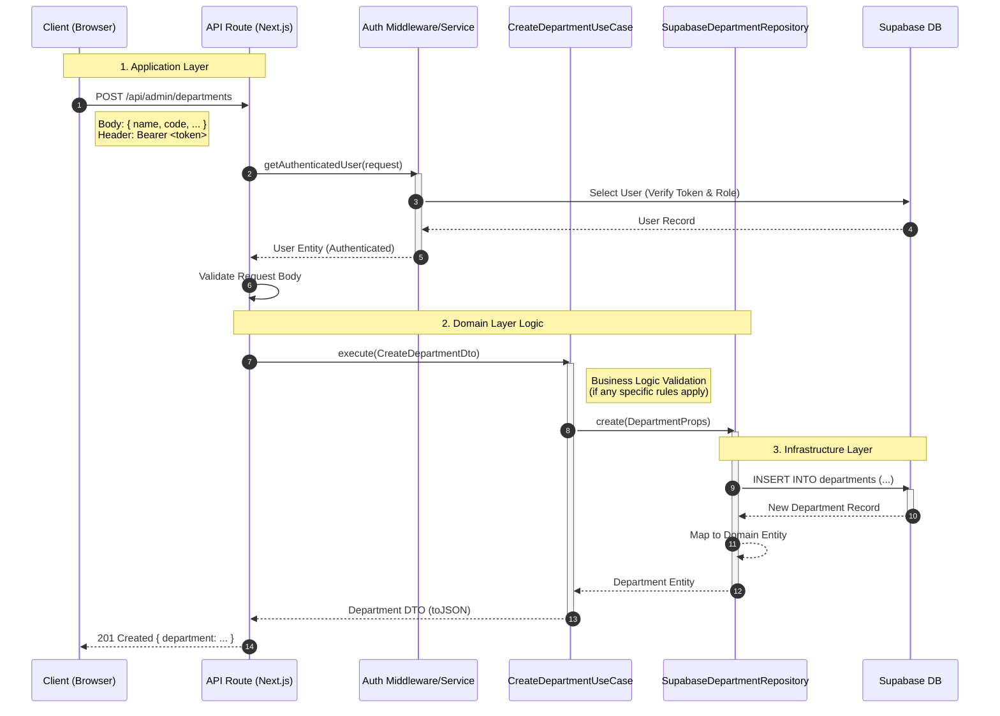
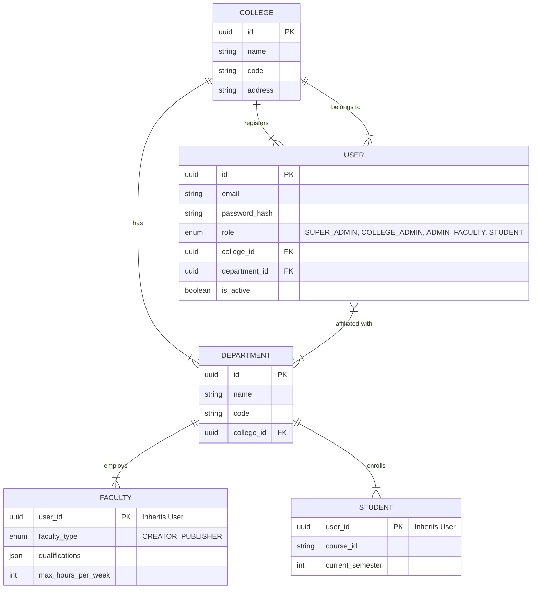
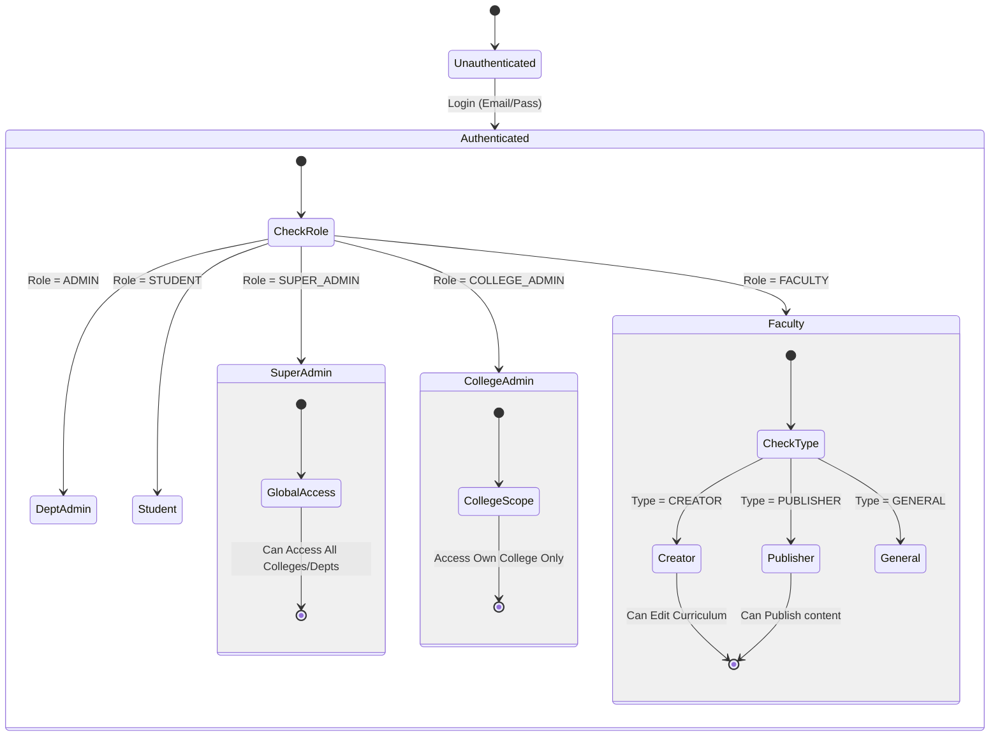

# System Architecture & Design

This document outlines the high-level architecture of the **Academic Compass 2025** platform.

## Architecture Overview

The system follows a **Modular Monolithic Architecture**. This approach structures the application into distinct, self-contained modules based on business domains (e.g., Auth, College, Student), while still deploying as a single unit (Monolith). This balances the simplicity of a monolith with the organizational benefits of microservices.

### Key Architectural Patterns
- **Domain-Driven Design (DDD)** principles (Entities, Value Objects, Aggregates).
- **Clean Architecture** (Separation of Domain, Application, and Infrastructure layers).
- **Repository Pattern** for data access abstraction.
- **Use Case** pattern for business logic encapsulation.

## High-Level System Diagram

```mermaid
graph TD
    %% Styling
    classDef client fill:#e1f5fe,stroke:#01579b,stroke-width:2px;
    classDef api fill:#e8f5e9,stroke:#2e7d32,stroke-width:2px;
    classDef module fill:#fff3e0,stroke:#ef6c00,stroke-width:2px,stroke-dasharray: 5 5;
    classDef core fill:#fff3e0,stroke:#ef6c00,stroke-width:2px;
    classDef shared fill:#f3e5f5,stroke:#7b1fa2,stroke-width:2px;
    classDef infra fill:#eceff1,stroke:#455a64,stroke-width:2px;
    classDef db fill:#e0f7fa,stroke:#006064,stroke-width:2px,shape:cylinder;

    User((User))

    subgraph "Client Layer (Next.js)"
        UI[Web Interface / Client App]:::client
    end

    subgraph "Application Core (Modular Monolith)"
        API[API / Controllers]:::api

        subgraph "Modules"
            Auth[Auth Module]:::core
            College[College Module]:::core
            Dept[Department Module]:::core
            Faculty[Faculty Module]:::core
            
            subgraph "In Progress Modules"
                Student[Student Module]:::module
                Timetable[Timetable Module]:::module
                NEP[NEP Curriculum Module]:::module
                Events[Events Module]:::module
                Notifs[Notifications Module]:::module
                classroom[Classroom Module]:::module
                batch[Batch Module]:::module
                elective[Elective Module]:::module
                dashboard[Dashboard Module]:::module
            end
        end

        Shared[Shared Kernel / Shared Module]:::shared
    end

    subgraph "Infrastructure Layer"
        Repos[Repositories (Supabase Impl)]:::infra
        Supabase[(Supabase DB & Auth)]:::db
    end

    %% Relationships
    User --> UI
    UI --> API
    API --> Auth
    API --> College
    API --> Dept
    API --> Faculty
    API --> Student

    %% Module Dependencies (Conceptual)
    Auth -.-> Shared
    College -.-> Shared
    Dept -.-> Shared
    Faculty -.-> Shared
    Student -.-> Shared
    
    %% Cross-Module Communication
    Dept -->|Depends on| College
    Faculty -->|Depends on| Dept
    Student -->|Depends on| Dept
    Student -->|Depends on| College

    %% Infrastructure
    Auth --> Repos
    College --> Repos
    Dept --> Repos
    Faculty --> Repos
    Student --> Repos

    Repos --> Supabase
```

## Module Descriptions

| Module | Status | Description |
| :--- | :--- | :--- |
| **Auth** | ✅ Complete | Handles user authentication, registration, password hashing, and token management. |
| **College** | ✅ Complete | Manages college entities and their metadata. |
| **Department** | ✅ Complete | Manages departments within colleges. linked to College module. |
| **Faculty** | ✅ Complete | Manages faculty profiles, qualifications, and types (Creator, Publisher, etc.). |
| **Student** | 🔄 In Progress | Handles student profiles and related academic data. |
| **Timetable** | 🔄 In Progress | Manages academic schedules and conflicts. |
| **NEP Curriculum** | 🔄 In Progress | implements the New Education Policy curriculum structure. |
| **Events** | 🔄 In Progress | Manages campus and academic events. |
| **Notifications** | 🔄 In Progress | Handles system-wide notifications and alerts. |

## Technology Stack

- **Frontend/Framework**: Next.js (React)
- **Language**: TypeScript
- **Database**: Supabase (PostgreSQL)
- **Styling**: Tailwind CSS (inferred from `tailwind.config.js`)
- **Testing**: Vitest (inferred from `vitest.config.ts`)

## Directory Structure Strategy

```text
src/
├── modules/               # Functional Modules
│   ├── auth/
│   │   ├── domain/        # Entities, Interfaces
│   │   ├── application/   # Use Cases, DTOs
│   │   └── infrastructure/# Repositories, API implementation
│   ├── college/
│   └── ...
├── shared/                # Shared Kernel (Common code used across modules)
├── app/                   # Next.js App Router (UI & Routing)
└── core/                  # Core Framework utilities
```

## Data & Logic Flow (Request Lifecycle)

The following sequence diagram illustrates the lifecycle of a request, demonstrating how data flows through the Modular Monolith architecture. We use **"Create Department"** as a representative example.



## Data Model (ERD)

This entity-relationship diagram shows the core entities and their relationships, highlighting the multi-tenant structure (College -> Department -> Faculty/Student).



## Hybrid Scheduler Algorithm (Logic Flow)

The **core differentiator** of this platform is the Hybrid Timetable Scheduler. This flowchart illustrates the intended hybrid algorithm (CP-SAT + Genetic Algorithm).

```mermaid
flowchart TD
    Start([Start Generation]) --> Params[Input Parameters:<br/>Strategies, Constraints, Timeout]
    Params --> Phase1{Phase 1:<br/>Initial Solution}
    
    %% CP-SAT Branch
    Phase1 -->|Sequential/Hybrid| CPSAT[CP-SAT Solver]
    CPSAT -->|Generates| InitialPool[Initial Feasible Solutions]
    
    %% Genetic Algorithm Branch
    InitialPool --> GA_Start[Initialize Genetic Algorithm]
    GA_Start --> Selection[Selection Phase]
    Selection --> Crossover[Crossover Operation]
    Crossover --> Mutation[Mutation Operation]
    Mutation --> Fitness[Evaluate Fitness<br/>(Soft Constraints)]
    
    Fitness --> Converged{Converged?}
    Converged -- No --> Selection
    Converged -- Yes --> BestSol[Select Best Solution]
    
    %% Output
    BestSol --> SaveDB[(Save to Database)]
    SaveDB --> End([End])
    
    style CPSAT fill:#d1c4e9,stroke:#512da8,stroke-width:2px
    style GA_Start fill:#ffecb3,stroke:#ffa000,stroke-width:2px
    style BestSol fill:#c8e6c9,stroke:#2e7d32,stroke-width:2px
```

## Authentication & Authorization (RBAC)

This state diagram illustrates the Role-Based Access Control logic for determining user permissions.



