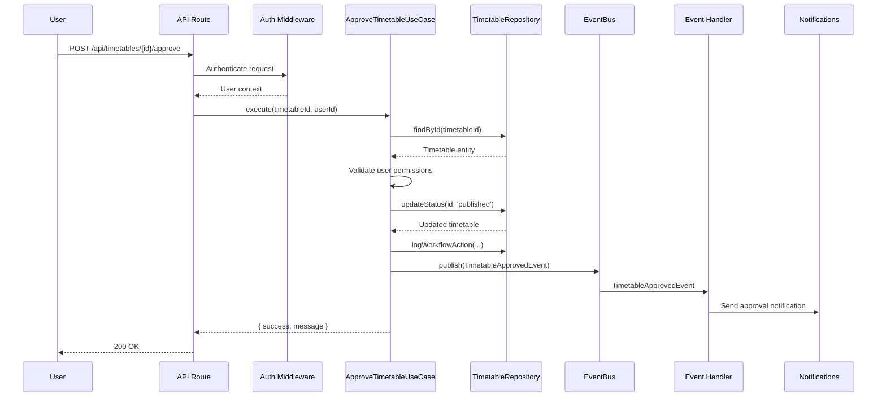
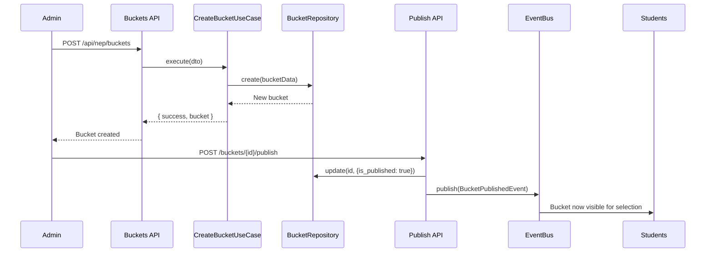
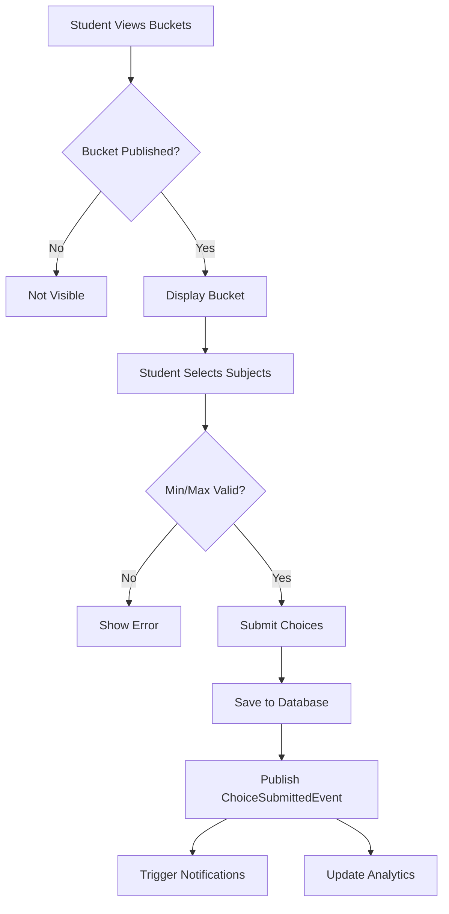
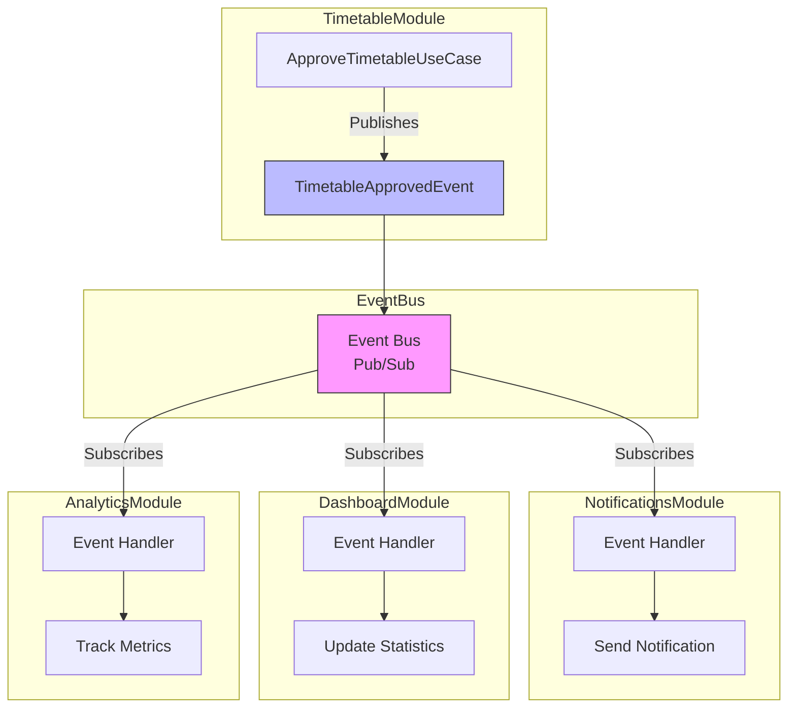
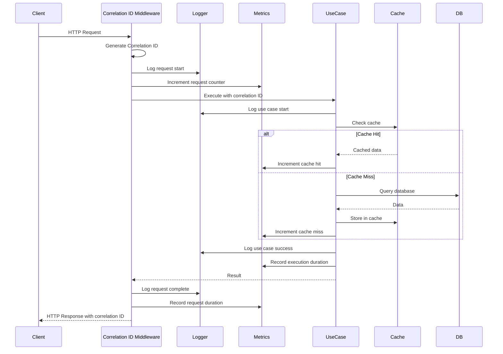
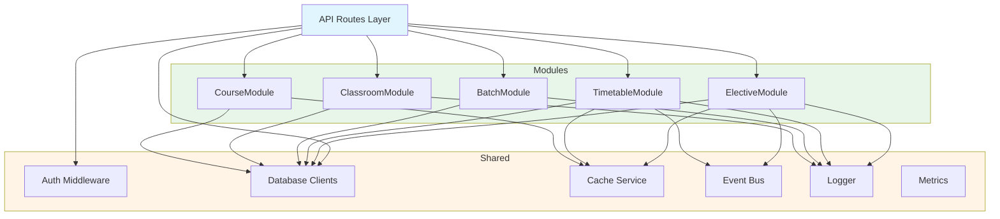
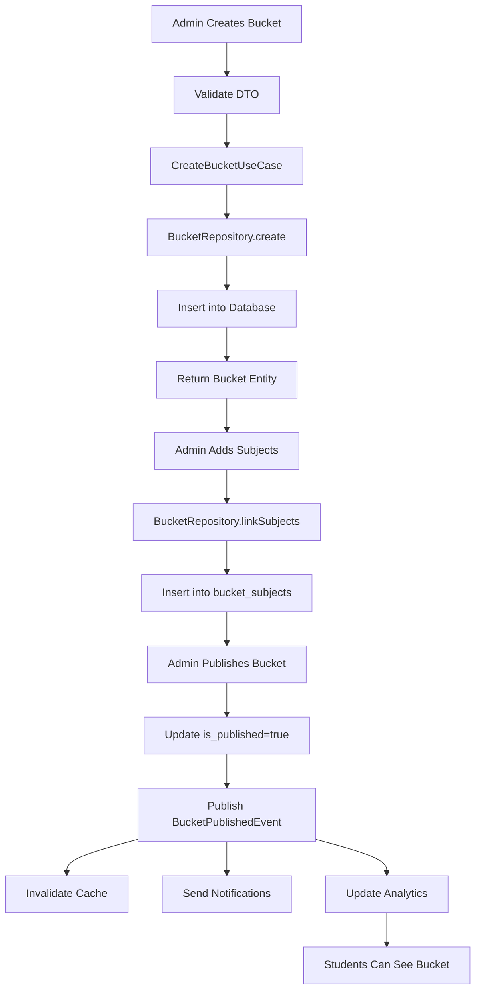

# Module Interaction Diagrams

This document contains sequence diagrams and flow charts showing how modules interact with each other.

---

## 1. Timetable Approval Workflow



---

## 2. Elective Bucket Creation & Publishing



---

## 3. Student Subject Choice Flow



---

## 4. Cache Invalidation Flow

```mermaid
flowchart LR
    A[User Updates Course] --> B[UpdateCourseUseCase]
    B --> C[@CacheInvalidate Decorator]
    C --> D[Execute Update]
    D --> E[Delete Cache Key]
    E --> F[Update Database]
    F --> G[Return Updated Course]
    
    H[Next Request] --> I[Read Cache]
    I --> J{Cache Hit?}
    J -->|No - Invalidated| K[Fetch from DB]
    K --> L[Cache Result]
    J -->|Yes| M[Return Cached]
```

---

## 5. Event-Driven Module Communication



---

## 6. Request Flow with Observability



---

## 7. Module Dependency Hierarchy



---

## 8. Data Flow: Create to Publish



---

## Diagram Usage

These diagrams are written in **Mermaid** syntax and will render automatically in:
- GitHub
- Markdown previews that support Mermaid
- Documentation sites (Docusaurus, MkDocs, etc.)

To view locally, use a Mermaid preview extension or paste into [Mermaid Live Editor](https://mermaid.live).
