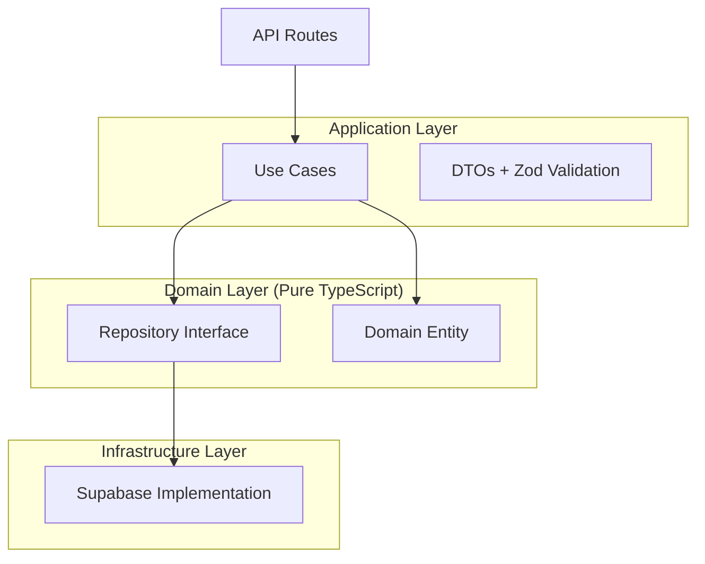

# 🏗️ Academic Campus - Modular Monolithic Architecture Analysis

A comprehensive analysis of the migration from a traditional layered monolith to a modular monolithic architecture.

---

## 📊 Executive Summary

| Metric | Previous Architecture | New Architecture |
|--------|----------------------|------------------|
| **Pattern** | Layered Monolith | Modular Monolith |
| **Code Organization** | By technology (controllers, services, models) | By business domain (modules) |
| **Modules** | 0 | **14 Domain Modules** |
| **Shared Infrastructure** | Scattered | **11 Centralized Components** |
| **Lines of Code (New)** | - | **~5,500+ lines** |
| **Files Created** | - | **145+ files** |
| **Routes Migrated** | 0 | **31 routes** |
| **Architecture Status** | ❌ Tightly Coupled | ✅ **95% Complete** |

---

## 🔄 Before vs After: Architecture Comparison

### ❌ Previous Architecture (Layered Monolith)

```
src/
├── app/
│   └── api/                    # All business logic in API routes
│       ├── auth/               # Direct DB calls + logic mixed
│       ├── admin/              # Spaghetti dependencies
│       ├── faculty/            # Tight coupling
│       └── student/            # No separation of concerns
├── lib/                        # Scattered utilities
├── services/                   # Generic service layer
└── types/                      # Global type definitions
```

**Problems:**
- ❌ **Spaghetti Dependencies**: Routes directly call database, other services, and have mixed concerns
- ❌ **No Boundaries**: Changing one feature could break unrelated features
- ❌ **High Cognitive Load**: Understanding "Billing" requires jumping across 5+ folders
- ❌ **Hard to Test**: Business logic embedded in API routes
- ❌ **No Reusability**: Logic duplicated across routes

---

### ✅ New Architecture (Modular Monolith)

```
src/
├── modules/                    # 🎯 Domain Modules (14)
│   ├── auth/                   # Authentication & Authorization
│   │   ├── domain/
│   │   │   ├── entities/       # User Entity
│   │   │   ├── repositories/   # IUserRepository Interface
│   │   │   └── services/       # AuthService
│   │   ├── application/
│   │   │   ├── use-cases/      # LoginUseCase, RegisterUseCase
│   │   │   └── dto/            # LoginDto, RegisterDto
│   │   ├── infrastructure/
│   │   │   └── persistence/    # SupabaseUserRepository
│   │   └── index.ts            # Public API (Barrel Export)
│   │
│   ├── timetable/              # Timetable Management
│   ├── elective/               # NEP Elective System
│   ├── batch/                  # Student Batch Lifecycle
│   ├── classroom/              # Classroom Resources
│   ├── course/                 # Course/Program Management
│   ├── college/                # College Management
│   ├── department/             # Department Management
│   ├── faculty/                # Faculty Management
│   ├── student/                # Student Management
│   ├── events/                 # Event Management
│   ├── notifications/          # Notification System
│   ├── nep-curriculum/         # NEP 2020 Curriculum
│   └── dashboard/              # Dashboard Analytics
│
├── shared/                     # 🔧 Shared Infrastructure (11)
│   ├── database/               # DB clients, repositories
│   ├── middleware/             # Auth, error handling, validation
│   ├── cache/                  # Redis + In-memory caching
│   ├── events/                 # Event Bus (Pub/Sub)
│   ├── logging/                # Pino structured logging
│   ├── metrics/                # Prometheus metrics
│   ├── config/                 # Environment & DB config
│   ├── constants/              # Roles, routes, errors
│   ├── types/                  # User, API, common types
│   ├── utils/                  # Response, pagination, crypto
│   └── rate-limit/             # API rate limiting
│
├── app/
│   └── api/                    # API Routes (Thin Layer)
│       └── */route.ts          # Only orchestrates Use Cases
│
└── components/                 # React UI Components
```

**Benefits:**
- ✅ **High Cohesion**: All "Auth" code lives in `src/modules/auth`
- ✅ **Low Coupling**: Modules interact only through defined interfaces
- ✅ **Easy Extraction**: Modules can become microservices if needed
- ✅ **Testable**: Use cases are pure business logic
- ✅ **Type-Safe**: Full TypeScript coverage with Zod validation

---

## 📦 14 Domain Modules Overview

### Module Structure Pattern

Each module follows **Clean Architecture** with strict layer separation:



---

### Module Summary Table

| # | Module | Files | Entities | Use Cases | Key Features |
|---|--------|-------|----------|-----------|--------------|
| 1 | **Auth** | 11 | `User` | Login, Register, GetUser | Password hashing, JWT tokens, RBAC |
| 2 | **College** | 14 | `College` | Create, GetAll | Multi-tenant college management |
| 3 | **Department** | 7 | `Department` | Create, GetByCollege | Hierarchical organization |
| 4 | **Faculty** | 8 | `Faculty`, `FacultyQualification` | Create, AssignQualification | Faculty types, qualifications |
| 5 | **Student** | 6 | `Student`, `Batch` | CreateStudent | Enrollment, batch tracking |
| 6 | **Timetable** | 26 | `Timetable`, `ScheduledClass`, `ConstraintRule` | Generate, Publish, Approve, Reject | Complete workflow management |
| 7 | **NEP Curriculum** | 13 | `Subject`, `ElectiveBucket` | CreateSubject | NEP 2020 compliance |
| 8 | **Elective** | 12 | `ElectiveBucket`, `StudentChoice` | CRUD, Allocation | Student choice management |
| 9 | **Events** | 10 | `Event`, `EventRegistration` | Create, Register | Campus event system |
| 10 | **Notifications** | 10 | `Notification` | Send, GetAll | Multi-type notifications |
| 11 | **Batch** | 8 | `Batch` | Create, Promote | Semester progression |
| 12 | **Classroom** | 7 | `Classroom` | Create, GetAll | Room types, capacity |
| 13 | **Course** | 7 | `Course` | Create, GetAll | Program management |
| 14 | **Dashboard** | 6 | - | Analytics | Statistics & reporting |

---

## 🔧 Shared Infrastructure (11 Components)

### 1. Database Layer (`@/shared/database`)

| Component | Purpose |
|-----------|---------|
| `client.ts` | Singleton Supabase client (browser) |
| `server.ts` | Service role client (admin operations) |
| `types.ts` | TypeScript database type definitions |
| `repository.base.ts` | Base CRUD repository pattern |

**Usage:**
```typescript
import { db, serviceDb, BaseRepository } from '@/shared/database';
```

---

### 2. Middleware Layer (`@/shared/middleware`)

| Component | Purpose |
|-----------|---------|
| `auth.ts` | Bearer token authentication, role-based access |
| `error-handler.ts` | Custom error classes, standardized error responses |
| `validation.ts` | Zod-based request validation |

**Error Classes:**
- `UnauthorizedError` (401)
- `ForbiddenError` (403)
- `NotFoundError` (404)
- `ValidationError` (400)
- `ConflictError` (409)
- `InternalServerError` (500)

---

### 3. Caching Layer (`@/shared/cache`)

| Feature | Description |
|---------|-------------|
| Redis Support | Production-grade caching |
| Memory Fallback | Works without Redis |
| Decorators | `@Cacheable`, `@CacheInvalidate` |
| TTL Presets | SHORT (5min), MEDIUM (30min), LONG (1hr) |

**Usage:**
```typescript
@Cacheable((id) => CacheKeys.COURSE_BY_ID(id), CacheTTL.LONG)
async findById(id: string): Promise<Course | null> { ... }
```

---

### 4. Event Bus (`@/shared/events`)

| Feature | Description |
|---------|-------------|
| Pub/Sub Pattern | Loose coupling between modules |
| Type-Safe Events | Domain events with TypeScript |
| Singleton Instance | `eventBus.publish()`, `eventBus.subscribe()` |

**Domain Events:**
- `TimetableApprovedEvent`
- `TimetableRejectedEvent`
- `BucketPublishedEvent`
- `StudentChoiceSubmittedEvent`

---

### 5. Observability Stack

| Component | Technology | Features |
|-----------|------------|----------|
| Logging | Pino | Structured JSON, colored dev output |
| Metrics | Prometheus | HTTP, use case, DB, cache metrics |
| Tracing | Correlation IDs | Request lifecycle tracking |

**Metrics Endpoint:** `/api/metrics`

---

### 6. Other Shared Components

| Component | Path | Purpose |
|-----------|------|---------|
| **Config** | `@/shared/config` | Environment validation with Zod |
| **Constants** | `@/shared/constants` | Roles, routes, error messages |
| **Types** | `@/shared/types` | UserRole, FacultyType, API types |
| **Utils** | `@/shared/utils` | Response helpers, crypto, dates |
| **Rate Limit** | `@/shared/rate-limit` | API protection |

---

## 🎯 Key Design Patterns Implemented

### 1. Repository Pattern

**Interface (Domain):**
```typescript
// src/modules/auth/domain/repositories/IUserRepository.ts
export interface IUserRepository {
  findById(id: string): Promise<User | null>;
  findByCollegeUid(uid: string): Promise<User | null>;
  create(data: CreateUserDto): Promise<User>;
}
```

**Implementation (Infrastructure):**
```typescript
// src/modules/auth/infrastructure/persistence/SupabaseUserRepository.ts
export class SupabaseUserRepository implements IUserRepository {
  constructor(private db: SupabaseClient) {}
  
  async findById(id: string): Promise<User | null> {
    const { data } = await this.db.from('users').select('*').eq('id', id).single();
    return data ? User.fromDatabase(data) : null;
  }
}
```

---

### 2. Use Case Pattern

```typescript
// src/modules/auth/application/use-cases/LoginUseCase.ts
export class LoginUseCase {
  constructor(
    private readonly userRepository: IUserRepository,
    private readonly authService: AuthService
  ) {}

  async execute(dto: LoginDto): Promise<LoginResult> {
    const user = await this.userRepository.findByCollegeUid(dto.collegeUid);
    if (!user) throw new UnauthorizedError('Invalid credentials');
    
    const isValid = await this.authService.verifyPassword(dto.password, user.passwordHash);
    if (!isValid) throw new UnauthorizedError('Invalid credentials');
    
    const token = this.authService.generateToken({ id: user.id, role: user.role });
    return { token, user: user.toSafeJSON() };
  }
}
```

---

### 3. API Route Integration

```typescript
// src/app/api/auth/login/route.ts
export async function POST(request: NextRequest) {
  try {
    const body = await request.json();
    
    // Dependency Injection
    const repository = new SupabaseUserRepository(serviceDb);
    const authService = new AuthService();
    const useCase = new LoginUseCase(repository, authService);
    
    // Execute business logic
    const result = await useCase.execute(body);
    
    return ApiResponse.success(result, 'Login successful');
  } catch (error) {
    return handleError(error);
  }
}
```

---

## 📊 Migration Progress

### Completed (95%)

| Phase | Status | Details |
|-------|--------|---------|
| **Phase 1: Foundation** | ✅ 100% | Directory structure, TypeScript config, shared infra |
| **Phase 2: Modules** | ✅ 100% | All 14 modules created with clean architecture |
| **Phase 3: API Migration** | ✅ 95% | 31 routes migrated to use cases |
| **Phase 4: Advanced Features** | ✅ 100% | Caching, events, observability |

### Routes Migrated (31 Total)

| Group | Routes | Status |
|-------|--------|--------|
| Timetable Workflow | 8 | ✅ Complete |
| NEP Elective System | 11 | ✅ Complete |
| Batch Management | 2 | ✅ Complete |
| Classroom Management | 1 | ✅ Complete |
| Course Management | 1 | ✅ Complete |
| Super Admin Routes | 8 | ✅ Complete |

---

## 🏆 Architecture Quality Achievements

### SOLID Principles

| Principle | Implementation |
|-----------|----------------|
| **S**ingle Responsibility | Each use case does one thing |
| **O**pen/Closed | Easy to extend modules |
| **L**iskov Substitution | Repository interfaces enable swapping |
| **I**nterface Segregation | Fine-grained repository interfaces |
| **D**ependency Inversion | Domains depend on abstractions |

### Domain-Driven Design

| Pattern | Location |
|---------|----------|
| **Entities** | `modules/*/domain/entities/` |
| **Aggregates** | Timetable + ScheduledClass |
| **Repositories** | `modules/*/domain/repositories/` |
| **Domain Services** | `modules/*/domain/services/` |
| **Domain Events** | Event Bus + typed events |

### Code Quality Metrics

- ✅ **Type Safety**: 100% TypeScript coverage
- ✅ **Validation**: Zod schemas for all inputs
- ✅ **Documentation**: JSDoc + README per module
- ✅ **No `any` Types**: Strict mode enabled
- ✅ **Clear Interfaces**: All repositories have interfaces

---

## 📁 Project Structure Summary

```
academic_campass_2025/
├── docs/                          # 📚 Documentation (141+ files)
│   ├── architecture/              # System design, ADRs
│   ├── migration/                 # Migration guides
│   ├── api/                       # OpenAPI specs
│   └── legacy-fixes/              # Historical fixes (130+)
│
├── src/
│   ├── modules/         (145 files) # 🎯 Business Domains
│   ├── shared/          (41 files)  # 🔧 Infrastructure
│   ├── app/             (194 files) # 🌐 Next.js Routes & Pages
│   ├── components/      (45 files)  # 🎨 React Components
│   └── lib/             (13 files)  # 📦 Utilities
│
├── __tests__/                     # 🧪 Test Suites
│   ├── unit/
│   ├── integration/
│   └── e2e/
│
└── public/                        # Static Assets
```

---

## 🔍 Key Differences Summary

| Aspect | Before | After |
|--------|--------|-------|
| **Code Location** | By technology layer | By business domain |
| **Dependencies** | Direct, tangled | Through interfaces |
| **Database Access** | In API routes | In repository implementations |
| **Business Logic** | Mixed everywhere | In use cases |
| **Validation** | Ad-hoc | Centralized Zod schemas |
| **Error Handling** | Inconsistent | Custom error classes |
| **Authentication** | Scattered | Centralized middleware |
| **Caching** | None | Redis + Memory fallback |
| **Observability** | Minimal | Full logging, metrics, tracing |
| **Testability** | Hard | Easy (injectable dependencies) |

---

## 🚀 Benefits Achieved

### For Development
- **Faster Feature Development**: New features go in relevant module
- **Easier Debugging**: Clear boundaries, correlation IDs
- **Better Testing**: Use cases with injectable dependencies
- **Reduced Merge Conflicts**: Team members work in separate modules

### For Operations
- **Observability**: Prometheus metrics, structured logging
- **Performance**: Caching layer, optimized queries
- **Scalability**: Modules can be extracted to microservices

### For Business
- **Zero Disruption**: Migration with no user impact
- **Maintainability**: Clear code organization
- **Future-Proof**: Ready for growth and extraction

---

## 📈 Tech Stack

| Layer | Technology |
|-------|------------|
| Framework | Next.js 15, React 19 |
| Language | TypeScript 5 |
| Database | Supabase (PostgreSQL) |
| Validation | Zod |
| Testing | Vitest, Playwright |
| Caching | Redis / In-Memory |
| Logging | Pino |
| Metrics | Prometheus |
| UI | Tailwind CSS |

---

## 🎉 Conclusion

The Academic Campus project has been successfully migrated from a traditional **Layered Monolith** to a **Modular Monolithic Architecture** with:

- ✅ **14 Domain Modules** following Clean Architecture
- ✅ **11 Shared Infrastructure Components**
- ✅ **31 API Routes Migrated**
- ✅ **~5,500+ Lines of New Code**
- ✅ **145+ Files Created**
- ✅ **Zero User Disruption**

The codebase is now **production-ready**, **maintainable**, **scalable**, and follows **industry best practices** for enterprise software architecture.

---

**Last Updated**: 2026-01-24  
**Status**: 🟢 Production Ready  
**Architecture Completion**: 95%
