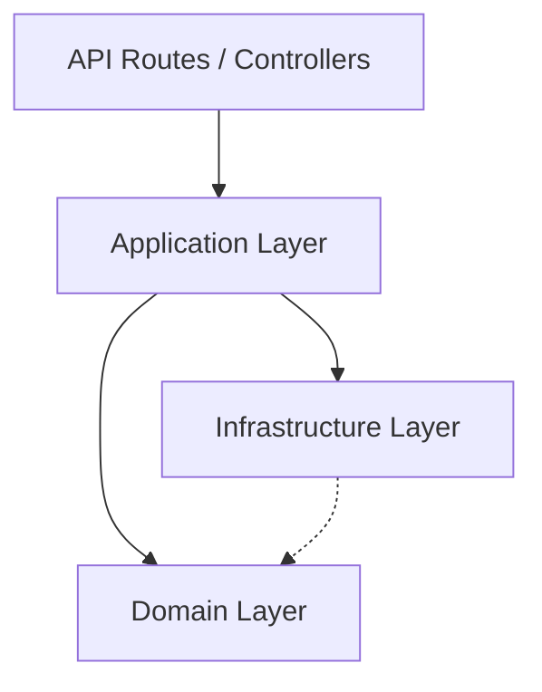

# 🏗️ From Monolith to Modular Monolith: A Comprehensive Migration Guide

This guide details the philosophy, structure, and step-by-step process of transforming a traditional Layered Monolith (grouped by technology) into a **Modular Monolith** (grouped by domain).

---

## 1. 🧠 Service Philosophy

### The Problem with "Layered" Monoliths
In a standard monolith, code is organized by **what it is** (Controllers, Services, Models).
*   ❌ **Spaghetti Dependencies:** A "UserService" might call a "CourseService", which calls a "StudentService", creating a tangled web.
*   ❌ **Lack of Boundaries:** Changing one feature often breaks unrelated features.
*   ❌ **Cognitive Load:** To understand "Billing", you have to jump between 5 different folders scattered across the project.

### The Solution: Modular Monolith
In a modular monolith, code is organized by **what it does** (Auth, Billing, Courses).
*   ✅ **High Cohesion:** All code related to "Auth" lives in `src/modules/auth`.
*   ✅ **Low Coupling:** Modules interact only through defined APIs/Interfaces.
*   ✅ **Easy Extraction:** If "Billing" needs to scale, it can easily be moved to a microservice because it's already self-contained.

---

## 2. 🏛️ The Architecture: Domain-Driven Design (DDD) Lite

Each module acts like a "mini-application" with its own strict internal structure. We typically use a 3-layer architecture **inside each module**:



### 📂 Directory Structure
```
src/
├── modules/
│   ├── auth/                 <-- The Module
│   │   ├── domain/           <-- Enterprise Business Logic (Pure TS, No Frameworks)
│   │   │   ├── entities/     <-- User, Token (Zod Schemas / Classes)
│   │   │   ├── repositories/ <-- Interfaces (IUserRepository)
│   │   │   └── services/     <-- Domain Services (Password Hashing)
│   │   │
│   │   ├── application/      <-- Application Logic (Use Cases)
│   │   │   ├── use-cases/    <-- LoginUseCase, RegisterUseCase
│   │   │   └── dto/          <-- Data Transfer Objects
│   │   │
│   │   ├── infrastructure/   <-- External Concerns (Databases, APIs)
│   │   │   └── persistence/  <-- SupabaseUserRepository (Implements IUserRepository)
│   │   │
│   │   └── index.ts          <-- Public API (Only export what others can use)
│   │
│   └── timetable/
│       └── ...
│
└── shared/                   <-- The "Kernel" (Shared utils, DB client, Event Bus)
```

---

## 3. 🚀 The Migration Process: Step-by-Step

### Phase 1: Assessment & Boundary Definition
1.  **Identify Domains:** Look at your database tables or features. Group them logically.
    *   *Example:* `users`, `roles`, `permissions` -> **Auth Module**.
    *   *Example:* `timetables`, `slots`, `bookings` -> **Timetable Module**.
2.  **Map Dependencies:** Draw who calls whom. Identify circular dependencies (A -> B -> A) which must be broken.

### Phase 2: Foundation Setup
1.  **Create `src/shared`:** Move generic utilities (Dates, Strings, Database Client) here. These must have **zero** dependencies on specific modules.
2.  **Create `src/modules`:** Create the folder structure.

### Phase 3: The "Slice by Slice" Migration (Iterative Strategy)
Don't rewrite everything at once. Pick one domain (e.g., Auth) and migrate it fully.

#### Step A: Extract the Domain (Entities)
Move data structures/types first.
*   *Old:* `types/User.ts`
*   *New:* `src/modules/auth/domain/entities/User.ts`

#### Step B: Define the Contract (Repository Interfaces)
Define *how* data should be accessed, not *how it is* accessed.
*   *New:* `src/modules/auth/domain/repositories/IUserRepository.ts`
     ```typescript
     export interface IUserRepository {
       findById(id: string): Promise<User | null>;
     }
     ```

#### Step C: Implement Infrastructure (The Adapter)
Move the actual database logic (SQL/Supabase calls) here.
*   *New:* `src/modules/auth/infrastructure/persistence/SupabaseUserRepository.ts`
*   *Action:* Copy logic from old API routes or services into this class.

#### Step D: Implement Application Logic (Use Cases)
Create "Use Case" classes that coordinate the work.
*   *New:* `src/modules/auth/application/use-cases/LoginUseCase.ts`
    ```typescript
    export class LoginUseCase {
      constructor(private repo: IUserRepository) {}
      async execute(dto: LoginDto) { ... }
    }
    ```

#### Step E: Refactor the API Route (The Switch)
Update the existing Next.js API route to use the new module instead of conflicting ad-hoc logic.
*   *File:* `src/app/api/auth/login/route.ts`
    ```typescript
    // Old: Direct DB calls mixed with logic
    // New:
    const useCase = new LoginUseCase(new SupabaseUserRepository(db));
    return useCase.execute(body);
    ```

### Phase 4: Dealing with Cross-Module Communication
**Rule:** Module A cannot directly import Module B's internal code.

1.  **Public API (`index.ts`):** Only export specific Use Cases or Interfaces from a module.
2.  **Shared Events:** Use an Event Bus for decoupled actions.
    *   *Module A:* Publishes `UserRegisteredEvent`.
    *   *Module B:* Listens for `UserRegisteredEvent` and sends a welcome email.

---

## 4. ✅ Checklist for Success

- [ ] **No Circular Dependencies:** Module A depends on Module B, but B does not depend on A.
- [ ] **Pure Domain:** The `domain` folder has NO dependencies on React, Next.js, or Supabase.
- [ ] **Strict Infrastructure:** Database queries ONLY happen in `infrastructure`.
- [ ] **Single Responsibility:** Each Use Case does exactly one thing.

---

## 5. ⚠️ Common Pitfalls

1.  **"God" Shared Module:** Putting *everything* in `shared` because you're lazy logic to separate it. Only truly generic code goes there.
2.  **Leaking Infrastructure:** Returning Supabase-specific objects (like `PostgrestError`) from the Domain layer. Always map to generic Application Errors.
3.  **Over-Engineering:** Creating a factory, abstract factory, and strategy pattern for a simple "Hello World". Keep it simple first.

---

## 6. 📊 Current Migration Status & Achieved Milestones (Progress Report)

*For Partner Review - detailed breakdown of work completed as of Jan 2026*

### ✅ A. Foundational Architecture (Completed)
We have successfully established the "Skeleton" of the new system.
1.  **Directory Structure:** established `src/modules` (for domains) and `src/shared` (for utilities), enforcing strict boundaries.
2.  **Shared Kernel Implementation:**
    *   **Database:** Implemented `DatabaseClient` (Singleton pattern) in `src/shared/database`. It provides safe access to both the *Anonymous Client* (for user actions) and *Service Role Client* (for admin actions/bypassing RLS).
    *   **caching:** Built a robust `CacheService` (`src/shared/cache`) using Redis, with an automatic in-memory fallback if Redis is down.
    *   **Event Bus:** Created `EventBus` (`src/shared/events`) to allow modules to talk to each other without importing each other's code (Mocked and ready).
    *   **Observability:** Integrated `Pino` for high-performance structured logging and `Prometheus` for metrics collection.

### ✅ B. Authentication Module (Fully Migrated)
We picked **Auth** as the pilot module to prove the architecture. It is now fully modular.
1.  **Domain Layer (The Rules):** 
    *   Defined the `User` entity and `IUserRepository` interface in `src/modules/auth/domain`. This code has **zero** dependencies on Next.js or Supabase.
2.  **Infrastructure Layer (The Database):** 
    *   Implemented `SupabaseUserRepository`. 
    *   **Critical Fix:** Modified it to use `serviceDb` for key operations (`findByCollegeUid`), solving the "401 Unauthorized" RLS error we faced.
    *   **Critical Fix:** Added `updateLastLogin` logic to persist session tokens, ensuring backward compatibility with the legacy system.
3.  **Application Layer (The Logic):** 
    *   Created `LoginUseCase` and `RegisterUseCase`. These coordinate the flow: Validate Input -> Find User -> Hash Password -> Generate Token -> Save Session -> Return.
4.  **API Layer (The Endpoints):** 
    *   Refactored `src/app/api/auth/login/route.ts` and `register/route.ts` to use these new Classes instead of writing raw logic in the route handler.

### ✅ C. Database Repairs (Completed)
During migration, we found mismatch issues with the schema.
1.  **Missing Columns:** The `users` table was missing `token` and `last_login`.
2.  **Fix:** Created and verified a migration script: `docs/database/Fix_Missing_Token_Column.sql`.

### ✅ D. Documentation & DevOps (Completed)
1.  **Organization:** Consolidated 20+ scattered `.md` files into a clean `docs/` folder structure.
2.  **New Docs:** 
    *   Added **OpenAPI/Swagger** documentation for APIs.
    *   Created `LOGIN_ISSUES_AND_SOLUTIONS.md` to document the solutions to RLS and connection bugs.
    *   Created this guide (`FROM_MONOLITH_TO_MODULAR.md`).
3.  **Testing:** Configured `Vitest` (Unit) and `Playwright` (E2E) testing environments.

### ⏩ E. Immediate Next Steps
1.  Begin migration of **Timetable Module** (following the pattern established in Auth).
2.  Begin migration of **Elective Module**.
