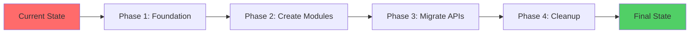

# Zero-Disruption Migration Strategy
## Maintaining Role-Based UI While Implementing Modular Monolithic Architecture

> **Goal**: Migrate to modular monolithic architecture WITHOUT disrupting the excellent role-based user experience  
> **Strategy**: Keep UI structure intact, refactor backend incrementally  
> **User Impact**: ZERO - Users won't notice any changes

---

## 📋 Table of Contents

1. [Current Architecture Analysis](#current-architecture-analysis)
2. [Hybrid Architecture Strategy](#hybrid-architecture-strategy)
3. [Migration Approach](#migration-approach)
4. [Detailed Implementation Plan](#detailed-implementation-plan)
5. [Code Examples](#code-examples)
6. [Testing Strategy](#testing-strategy)

---

## 🎯 Current Architecture Analysis

### What's Working GREAT (Keep As-Is)

Your **role-based UI structure** is excellent and should be **preserved**:

```
src/app/
├── super-admin/          ✅ Perfect - Keep this structure
│   ├── dashboard/
│   └── manage/
├── admin/                ✅ Perfect - Keep this structure
│   ├── dashboard/
│   ├── bucket_creator/
│   ├── batches/
│   ├── classrooms/
│   ├── departments/
│   ├── faculty/
│   ├── students/
│   └── subjects/
├── faculty/              ✅ Perfect - Keep this structure
│   ├── dashboard/
│   ├── ai-timetable-creator/
│   ├── manual-scheduling/
│   ├── timetables/
│   ├── subjects/
│   ├── qualifications/
│   ├── events/
│   └── notifications/
└── student/              ✅ Perfect - Keep this structure
    └── dashboard/
```

**Why This Structure is Excellent:**
- ✅ Clear role-based separation
- ✅ Easy to navigate for users
- ✅ Matches mental model of different user types
- ✅ Good for access control
- ✅ Scalable for adding new role-specific features

### What Needs Refactoring (Backend Only)

The **API layer and business logic** need modularization:

```
src/app/api/              ❌ Needs refactoring
├── admin/                   Mixed concerns
├── faculty/                 Business logic in routes
├── student/                 Direct database access
└── timetable/               Tight coupling
```

**Problems:**
- Business logic mixed with API routes
- Direct database access from routes
- No clear separation of concerns
- Difficult to test in isolation

---

## 🏗️ Hybrid Architecture Strategy

### The Solution: **Two-Layer Architecture**

```
┌─────────────────────────────────────────────────────────────┐
│                    PRESENTATION LAYER                        │
│              (Keep Current Role-Based Structure)             │
│                                                              │
│  src/app/                                                    │
│  ├── super-admin/  ← UI Pages (No Changes)                  │
│  ├── admin/        ← UI Pages (No Changes)                  │
│  ├── faculty/      ← UI Pages (No Changes)                  │
│  ├── student/      ← UI Pages (No Changes)                  │
│  └── api/          ← Thin routing layer (Refactor)          │
│                           ↓                                  │
└──────────────────────────┼──────────────────────────────────┘
                           ↓
┌──────────────────────────┼──────────────────────────────────┐
│                    BUSINESS LOGIC LAYER                      │
│              (New Modular Monolithic Structure)              │
│                                                              │
│  src/modules/                                                │
│  ├── auth/         ← Domain modules                         │
│  ├── college/      ← Clean architecture                     │
│  ├── department/   ← Testable, reusable                     │
│  ├── faculty/      ← Independent modules                    │
│  ├── student/      ← Clear boundaries                       │
│  ├── timetable/                                             │
│  └── nep-curriculum/                                        │
│                                                              │
│  src/shared/       ← Shared infrastructure                  │
│  src/core/         ← Core business logic                    │
└─────────────────────────────────────────────────────────────┘
```

### Key Principles

1. **UI Layer Stays Intact**
   - Keep all role-based folders (`super-admin/`, `admin/`, `faculty/`, `student/`)
   - Keep all page routes exactly the same
   - Users see NO changes

2. **API Layer Becomes Thin**
   - API routes become simple orchestrators
   - Delegate to domain modules
   - Handle HTTP concerns only

3. **Business Logic Moves to Modules**
   - Domain logic in modules
   - Reusable across different roles
   - Testable in isolation

---

## 🚀 Migration Approach

### Phase-by-Phase Migration (Zero Downtime)



### Migration Strategy: **Adapter Pattern**

Instead of rewriting everything, we'll create **adapters** that allow old and new code to coexist:

```typescript
// Old API route (before migration)
export async function GET(request: NextRequest) {
  // Direct database access
  const { data } = await supabase.from('users').select('*');
  return NextResponse.json(data);
}

// New API route (after migration) - Same endpoint, different implementation
export async function GET(request: NextRequest) {
  // Delegate to module
  const useCase = new GetUsersUseCase(new UserRepository());
  const users = await useCase.execute();
  return ApiResponse.success(users);
}
```

**Benefits:**
- ✅ Same endpoint URL
- ✅ Same response format
- ✅ No frontend changes needed
- ✅ Can migrate one endpoint at a time

---

## 📋 Detailed Implementation Plan

## PHASE 1: Foundation (Week 1-2)

### Goal: Set up infrastructure WITHOUT touching existing code

#### Week 1: Directory Structure

**Create new directories alongside existing code:**

```bash
# Create module directories (don't touch existing src/app/)
mkdir -p src/modules/{auth,college,department,faculty,student,timetable,nep-curriculum,events,notifications}

# Create shared infrastructure
mkdir -p src/shared/{database,middleware,utils,types,constants,config,events,cache,logging,security}

# Create core business logic
mkdir -p src/core/{ai,scheduling,validation}
```

**Result:** New folders exist, but old code still works perfectly.

#### Week 2: Shared Infrastructure

**Create shared utilities that both old and new code can use:**

```typescript
// src/shared/database/client.ts
// This can be used by both old API routes and new modules
export const db = createSupabaseClient();

// src/shared/middleware/auth.ts
// Reusable authentication that works everywhere
export async function authenticate(request: NextRequest) { ... }

// src/shared/utils/response.ts
// Standardized responses
export class ApiResponse { ... }
```

**Tasks:**
- [ ] Create `src/shared/database/client.ts`
- [ ] Create `src/shared/middleware/auth.ts`
- [ ] Create `src/shared/utils/response.ts`
- [ ] Create `src/shared/types/` (shared types)
- [ ] Update `tsconfig.json` with path aliases

**Result:** Shared utilities ready, old code unchanged.

---

## PHASE 2: Create Modules (Week 3-8)

### Goal: Build new modules WITHOUT breaking existing APIs

We'll create modules in parallel with existing code. Old APIs keep working.

### Week 3-4: Auth Module

**Create complete auth module:**

```
src/modules/auth/
├── domain/
│   ├── entities/User.ts
│   ├── repositories/IUserRepository.ts
│   └── services/AuthService.ts
├── application/
│   ├── use-cases/
│   │   ├── LoginUseCase.ts
│   │   ├── RegisterUseCase.ts
│   │   └── LogoutUseCase.ts
│   └── dto/
│       ├── LoginDto.ts
│       └── RegisterDto.ts
├── infrastructure/
│   └── persistence/
│       └── SupabaseUserRepository.ts
└── index.ts (public API)
```

**Key Point:** This module exists alongside old auth code. Nothing breaks.

**Testing:**
```typescript
// Test the new module independently
describe('LoginUseCase', () => {
  it('should authenticate valid user', async () => {
    const useCase = new LoginUseCase(mockRepository);
    const result = await useCase.execute({ email, password });
    expect(result.token).toBeDefined();
  });
});
```

### Week 5-6: College & Department Modules

**Create modules following same pattern:**

```
src/modules/college/
src/modules/department/
```

**Important:** These modules are self-contained and don't affect existing code.

### Week 7-8: Faculty & Student Modules

**Create modules:**

```
src/modules/faculty/
src/modules/student/
```

**Result:** All core modules exist, old code still works.

---

## PHASE 3: Migrate APIs (Week 9-16)

### Goal: Gradually replace old API implementations with new modules

### Strategy: One Endpoint at a Time

**Migration Pattern:**

```typescript
// BEFORE: src/app/api/admin/departments/route.ts
export async function GET(request: NextRequest) {
  // Old implementation - direct database access
  const { data } = await supabase
    .from('departments')
    .select('*');
  return NextResponse.json(data);
}

// AFTER: Same file, new implementation
import { GetDepartmentsUseCase } from '@/modules/department';
import { DepartmentRepository } from '@/modules/department/infrastructure';

export async function GET(request: NextRequest) {
  try {
    // Authenticate
    const user = await authenticate(request);
    
    // Delegate to module
    const repository = new DepartmentRepository();
    const useCase = new GetDepartmentsUseCase(repository);
    const departments = await useCase.execute({ collegeId: user.college_id });
    
    // Return standardized response
    return ApiResponse.success(departments);
  } catch (error) {
    return handleError(error);
  }
}
```

**Benefits:**
- ✅ Same URL: `/api/admin/departments`
- ✅ Same response format
- ✅ Frontend code unchanged
- ✅ Users see no difference

### Week 9-10: Migrate Admin APIs

**Migrate these endpoints one by one:**

- [ ] `/api/admin/departments` → Use `DepartmentModule`
- [ ] `/api/admin/faculty` → Use `FacultyModule`
- [ ] `/api/admin/students` → Use `StudentModule`
- [ ] `/api/admin/subjects` → Use `NEPCurriculumModule`
- [ ] `/api/admin/batches` → Use `StudentModule`
- [ ] `/api/admin/classrooms` → Use `TimetableModule`

**Testing After Each Migration:**
```bash
# Run existing tests - they should still pass
npm test

# Test the endpoint manually
curl http://localhost:3000/api/admin/departments
```

### Week 11-12: Migrate Faculty APIs

**Migrate these endpoints:**

- [ ] `/api/faculty` → Use `FacultyModule`
- [ ] `/api/faculty/qualifications` → Use `FacultyModule`
- [ ] `/api/timetable/generate` → Use `TimetableModule`
- [ ] `/api/timetables` → Use `TimetableModule`

### Week 13-14: Migrate Student APIs

**Migrate these endpoints:**

- [ ] `/api/student/dashboard` → Use `StudentModule`
- [ ] `/api/student/selections` → Use `NEPCurriculumModule`
- [ ] `/api/student/available-subjects` → Use `NEPCurriculumModule`

### Week 15-16: Migrate Remaining APIs

**Migrate:**

- [ ] `/api/events` → Use `EventsModule`
- [ ] `/api/notifications` → Use `NotificationsModule`
- [ ] `/api/constraints` → Use `TimetableModule`

**Result:** All APIs now use modular architecture, but URLs and responses are identical.

---

## PHASE 4: Cleanup & Optimization (Week 17-18)

### Week 17: Remove Old Code

**Now that all APIs use new modules, remove old code:**

```bash
# Remove old scattered utilities
rm src/lib/old-utils.ts

# Remove old service files that are now in modules
rm src/services/old-service.ts

# Keep only what's needed
```

**Tasks:**
- [ ] Identify unused old code
- [ ] Remove safely (one file at a time)
- [ ] Run tests after each removal
- [ ] Update imports

### Week 18: Optimization

**Optimize the new architecture:**

- [ ] Add caching to frequently accessed data
- [ ] Optimize database queries
- [ ] Add performance monitoring
- [ ] Review and refactor based on usage patterns

---

## 💻 Code Examples

### Example 1: Migrating Admin Dashboard API

**Current Implementation:**
```typescript
// src/app/api/admin/dashboard/route.ts (BEFORE)
import { NextRequest, NextResponse } from 'next/server';
import { createClient } from '@/lib/supabase';

export async function GET(request: NextRequest) {
  const authHeader = request.headers.get('authorization');
  if (!authHeader) {
    return NextResponse.json({ error: 'Unauthorized' }, { status: 401 });
  }

  const token = authHeader.substring(7);
  const user = JSON.parse(Buffer.from(token, 'base64').toString());

  const supabase = createClient();

  // Get departments
  const { data: departments } = await supabase
    .from('departments')
    .select('*')
    .eq('college_id', user.college_id);

  // Get faculty count
  const { count: facultyCount } = await supabase
    .from('users')
    .select('*', { count: 'exact', head: true })
    .eq('role', 'faculty')
    .eq('college_id', user.college_id);

  // Get student count
  const { count: studentCount } = await supabase
    .from('users')
    .select('*', { count: 'exact', head: true })
    .eq('role', 'student')
    .eq('college_id', user.college_id);

  return NextResponse.json({
    departments,
    facultyCount,
    studentCount
  });
}
```

**New Implementation (Same endpoint, better architecture):**
```typescript
// src/app/api/admin/dashboard/route.ts (AFTER)
import { NextRequest } from 'next/server';
import { authenticate } from '@/shared/middleware/auth';
import { ApiResponse } from '@/shared/utils/response';
import { handleError } from '@/shared/middleware/error-handler';
import { GetAdminDashboardUseCase } from '@/modules/admin/application/use-cases/GetAdminDashboardUseCase';
import { DepartmentRepository } from '@/modules/department/infrastructure/persistence/SupabaseDepartmentRepository';
import { FacultyRepository } from '@/modules/faculty/infrastructure/persistence/SupabaseFacultyRepository';
import { StudentRepository } from '@/modules/student/infrastructure/persistence/SupabaseStudentRepository';

export async function GET(request: NextRequest) {
  try {
    // Authenticate (reusable middleware)
    const user = await authenticate(request);
    if (!user) {
      return ApiResponse.error('Unauthorized', 401);
    }

    // Create repositories
    const departmentRepo = new DepartmentRepository();
    const facultyRepo = new FacultyRepository();
    const studentRepo = new StudentRepository();

    // Execute use case (business logic)
    const useCase = new GetAdminDashboardUseCase(
      departmentRepo,
      facultyRepo,
      studentRepo
    );

    const dashboard = await useCase.execute({
      collegeId: user.college_id!,
      userId: user.id
    });

    // Return standardized response
    return ApiResponse.success(dashboard);
  } catch (error) {
    return handleError(error);
  }
}
```

**The Use Case (Business Logic):**
```typescript
// src/modules/admin/application/use-cases/GetAdminDashboardUseCase.ts
import { IDepartmentRepository } from '@/modules/department/domain/repositories/IDepartmentRepository';
import { IFacultyRepository } from '@/modules/faculty/domain/repositories/IFacultyRepository';
import { IStudentRepository } from '@/modules/student/domain/repositories/IStudentRepository';

export interface AdminDashboardDto {
  departments: any[];
  facultyCount: number;
  studentCount: number;
  recentActivity: any[];
}

export class GetAdminDashboardUseCase {
  constructor(
    private readonly departmentRepo: IDepartmentRepository,
    private readonly facultyRepo: IFacultyRepository,
    private readonly studentRepo: IStudentRepository
  ) {}

  async execute(params: { collegeId: string; userId: string }): Promise<AdminDashboardDto> {
    // Business logic here
    const departments = await this.departmentRepo.findByCollege(params.collegeId);
    const facultyCount = await this.facultyRepo.countByCollege(params.collegeId);
    const studentCount = await this.studentRepo.countByCollege(params.collegeId);

    return {
      departments,
      facultyCount,
      studentCount,
      recentActivity: [] // TODO: Implement
    };
  }
}
```

**Benefits:**
- ✅ Same URL: `/api/admin/dashboard`
- ✅ Same response format
- ✅ Business logic is testable
- ✅ Reusable repositories
- ✅ Clear separation of concerns

### Example 2: Faculty Timetable API

**Before:**
```typescript
// src/app/api/faculty/timetables/route.ts (BEFORE)
export async function GET(request: NextRequest) {
  const user = getUser(request);
  const { data } = await supabase
    .from('generated_timetables')
    .select('*, scheduled_classes(*)')
    .eq('department_id', user.department_id);
  
  return NextResponse.json(data);
}
```

**After:**
```typescript
// src/app/api/faculty/timetables/route.ts (AFTER)
import { GetFacultyTimetablesUseCase } from '@/modules/timetable';

export async function GET(request: NextRequest) {
  try {
    const user = await authenticate(request);
    
    const useCase = new GetFacultyTimetablesUseCase(
      new TimetableRepository()
    );
    
    const timetables = await useCase.execute({
      departmentId: user.department_id!,
      facultyId: user.id
    });
    
    return ApiResponse.success(timetables);
  } catch (error) {
    return handleError(error);
  }
}
```

**Key Point:** Frontend code doesn't change at all!

```typescript
// Frontend code (UNCHANGED)
const response = await fetch('/api/faculty/timetables', {
  headers: { Authorization: `Bearer ${token}` }
});
const data = await response.json();
// Works exactly the same!
```

---

## 🎨 UI Layer Integration

### How UI Pages Use the New Architecture

Your UI pages (`src/app/admin/dashboard/page.tsx`, etc.) don't need to change!

**Before Migration:**
```typescript
// src/app/admin/dashboard/page.tsx
'use client';

export default function AdminDashboard() {
  const [data, setData] = useState(null);

  useEffect(() => {
    fetch('/api/admin/dashboard', {
      headers: { Authorization: `Bearer ${token}` }
    })
      .then(res => res.json())
      .then(setData);
  }, []);

  return <div>{/* Render dashboard */}</div>;
}
```

**After Migration:**
```typescript
// src/app/admin/dashboard/page.tsx
'use client';

export default function AdminDashboard() {
  const [data, setData] = useState(null);

  useEffect(() => {
    // SAME CODE - API endpoint unchanged!
    fetch('/api/admin/dashboard', {
      headers: { Authorization: `Bearer ${token}` }
    })
      .then(res => res.json())
      .then(setData);
  }, []);

  return <div>{/* Render dashboard */}</div>;
}
```

**Result:** UI code is **identical**. Zero changes needed!

---

## 🧪 Testing Strategy

### Testing During Migration

**1. Keep Existing Tests Running**
```bash
# All existing tests should continue to pass
npm test
```

**2. Add Module Tests**
```typescript
// Test new modules independently
describe('DepartmentModule', () => {
  describe('GetDepartmentsUseCase', () => {
    it('should return departments for college', async () => {
      const mockRepo = {
        findByCollege: jest.fn().mockResolvedValue([...])
      };
      
      const useCase = new GetDepartmentsUseCase(mockRepo);
      const result = await useCase.execute({ collegeId: '123' });
      
      expect(result).toHaveLength(2);
      expect(mockRepo.findByCollege).toHaveBeenCalledWith('123');
    });
  });
});
```

**3. Integration Tests**
```typescript
// Test that migrated APIs still work
describe('Admin Dashboard API', () => {
  it('should return dashboard data', async () => {
    const response = await fetch('/api/admin/dashboard', {
      headers: { Authorization: `Bearer ${validToken}` }
    });
    
    expect(response.status).toBe(200);
    const data = await response.json();
    expect(data).toHaveProperty('departments');
    expect(data).toHaveProperty('facultyCount');
  });
});
```

**4. Regression Testing**
```bash
# After each migration, run full test suite
npm run test:integration
npm run test:e2e
```

### Testing Checklist for Each Migrated Endpoint

- [ ] Unit tests for use case
- [ ] Unit tests for repository
- [ ] Integration test for API endpoint
- [ ] Manual testing in browser
- [ ] Check response format matches old format
- [ ] Verify frontend still works
- [ ] Check error handling
- [ ] Verify authorization works

---

## 📊 Migration Tracking

### Progress Dashboard

Create a simple tracking document:

```markdown
## API Migration Progress

### Admin APIs
- [x] /api/admin/dashboard - Migrated (Week 9)
- [x] /api/admin/departments - Migrated (Week 9)
- [ ] /api/admin/faculty - In Progress
- [ ] /api/admin/students - Not Started

### Faculty APIs
- [ ] /api/faculty/timetables - Not Started
- [ ] /api/faculty/qualifications - Not Started

### Student APIs
- [ ] /api/student/dashboard - Not Started
- [ ] /api/student/selections - Not Started

### Overall Progress: 15% Complete
```

### Weekly Checklist

**Every Week:**
- [ ] Migrate 3-5 endpoints
- [ ] Write tests for migrated endpoints
- [ ] Run full test suite
- [ ] Manual testing
- [ ] Code review
- [ ] Update progress tracker
- [ ] Deploy to staging
- [ ] Smoke test in staging

---

## 🎯 Success Criteria

### Technical Success

- [ ] All API endpoints migrated to use modules
- [ ] 80%+ test coverage on new modules
- [ ] Zero breaking changes to frontend
- [ ] All existing tests still pass
- [ ] Performance same or better

### User Success

- [ ] Users notice NO changes
- [ ] All features work exactly the same
- [ ] No downtime during migration
- [ ] Response times same or better
- [ ] No new bugs introduced

### Developer Success

- [ ] Code is more maintainable
- [ ] Easier to add new features
- [ ] Easier to test
- [ ] Better code organization
- [ ] Clear documentation

---

## 🚨 Risk Mitigation

### Potential Risks & Solutions

| Risk | Impact | Mitigation |
|------|--------|------------|
| Breaking existing functionality | High | Comprehensive testing, gradual migration |
| Performance degradation | Medium | Performance testing, benchmarking |
| Team confusion | Low | Clear documentation, training |
| Timeline overrun | Medium | Phased approach, prioritize critical paths |

### Rollback Strategy

**If something goes wrong:**

1. **Immediate Rollback**
   ```bash
   # Revert the specific file
   git checkout HEAD~1 src/app/api/admin/dashboard/route.ts
   
   # Deploy immediately
   npm run build && npm run deploy
   ```

2. **Feature Flag Rollback**
   ```typescript
   // Use feature flags for gradual rollout
   if (FEATURE_FLAGS.USE_NEW_ADMIN_API) {
     // New implementation
   } else {
     // Old implementation (fallback)
   }
   ```

3. **Database Rollback**
   - Keep old database schema
   - New modules work with existing schema
   - No schema changes during migration

---

## 📈 Timeline Summary

### 18-Week Migration Plan

| Phase | Weeks | Focus | User Impact |
|-------|-------|-------|-------------|
| Phase 1 | 1-2 | Foundation | None |
| Phase 2 | 3-8 | Create Modules | None |
| Phase 3 | 9-16 | Migrate APIs | None |
| Phase 4 | 17-18 | Cleanup | None |

**Total: 18 weeks (4.5 months)**

### Parallel Work Streams

- **Stream 1**: Shared infrastructure + Auth module
- **Stream 2**: College + Department modules
- **Stream 3**: Faculty + Student modules
- **Stream 4**: Timetable + NEP modules

Teams can work in parallel, reducing overall timeline.

---

## 🎓 Key Takeaways

### What Makes This Strategy Work

1. **UI Structure Unchanged**
   - Keep excellent role-based organization
   - Users see zero changes
   - No frontend refactoring needed

2. **Gradual Backend Migration**
   - One API endpoint at a time
   - Old and new code coexist
   - Easy to rollback if needed

3. **Same Endpoints, Better Implementation**
   - URLs don't change
   - Response formats don't change
   - Frontend code doesn't change

4. **Comprehensive Testing**
   - Test before migration
   - Test after migration
   - Continuous integration

5. **Clear Separation**
   - UI layer (role-based, unchanged)
   - API layer (thin routing, refactored)
   - Business logic (new modules)

---

## 🚀 Getting Started

### This Week

1. **Review with Team**
   - [ ] Present this strategy
   - [ ] Get buy-in from stakeholders
   - [ ] Assign responsibilities

2. **Set Up Environment**
   - [ ] Create feature branch
   - [ ] Set up development environment
   - [ ] Configure CI/CD

3. **Start Phase 1**
   - [ ] Create directory structure
   - [ ] Set up shared infrastructure
   - [ ] Update TypeScript config

### Next Week

1. **Build First Module**
   - [ ] Create Auth module
   - [ ] Write tests
   - [ ] Document usage

2. **Migrate First Endpoint**
   - [ ] Choose simple endpoint
   - [ ] Migrate to use new module
   - [ ] Test thoroughly
   - [ ] Deploy to staging

---

## 📞 Support

**Questions or Issues?**
- Technical Lead: [Name]
- Architecture Review: [Schedule]
- Slack Channel: #modular-migration

---

**Remember:** The goal is to improve the codebase WITHOUT disrupting users. Take it slow, test thoroughly, and celebrate small wins! 🎉

**Document Version**: 1.0.0  
**Last Updated**: 2026-01-21  
**Status**: Ready for Implementation
