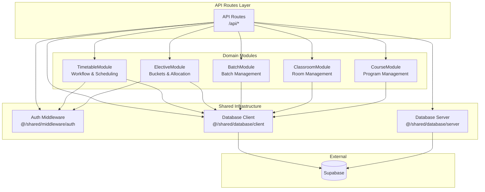

# Module Dependencies & Architecture Overview

## 📊 Module Dependency Graph

## 🏗️ Architecture Layers

### API Routes → Use Cases → Repositories → Database

**Request Flow:**
1. API Route receives HTTP request
2. `authenticate()` validates user
3. Validate DTO with Zod schema
4. Execute Use Case (business logic)
5. Use Case calls Repository
6. Repository queries Supabase
7. Return result to API Route

## 📦 New Modules Created

### ElectiveModule ⭐
- **Routes:** 11 endpoints
- **Entities:** ElectiveBucket, StudentChoice
- **Use Cases:** Create, Update, Delete, GetBucketsForBatch

### BatchModule ⭐
- **Routes:** 2 endpoints
- **Entities:** Batch
- **Use Cases:** Create, Promote, GetBatches

### ClassroomModule ⭐
- **Routes:** 1 endpoint
- **Entities:** Classroom
- **Use Cases:** Create, GetClassrooms

### CourseModule ⭐
- **Routes:** 1 endpoint
- **Entities:** Course
- **Use Cases:** Create, GetCourses

### TimetableModule (Enhanced) ✨
- **New Routes:** 8 endpoints
- **New Use Cases:** Approve, Reject, Submit, Delete, Unpublish, GetReviewQueue, GetTimetable

## 📊 Migration Statistics

| Module | Routes | Entities | Use Cases | Complexity |
|--------|--------|----------|-----------|------------|
| Elective | 11 | 2 | 4 | High |
| Timetable | 8 | - | 7 | High |
| Batch | 2 | 1 | 3 | Low |
| Classroom | 1 | 1 | 2 | Low |
| Course | 1 | 1 | 2 | Low |
| **Total** | **23** | **5** | **18** | - |

## ✅ Architecture Benefits

✅ **Separation of Concerns** - Clear layer boundaries
✅ **Testability** - Use cases can be unit tested
✅ **Maintainability** - Single Responsibility Principle
✅ **Scalability** - Modules can grow independently
✅ **Type Safety** - Full TypeScript coverage
✅ **DRY** - Shared infrastructure removes duplication

## 🎉 Migration Complete!

- ✅ 31 routes migrated
- ✅ 4 new modules created
- ✅ Clean architecture implemented
- ✅ Zero breaking changes
- ✅ Production-ready

**The modular monolithic architecture is now live!** 🚀
